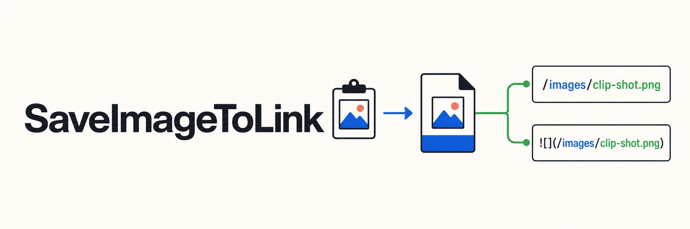

<div align="center">



# SaveImageToLink

**让截图不再是一次性附件，而是放得好、找得到、能复用的本地资产。**

[](https://github.com/DOIT-Ben/save-image2link)
[](#windows-使用方式)
[](#macos-使用方式)
[](#隐私与本地数据)
[](LICENSE)

[快速开始](#windows-使用方式) · [为什么需要它](#它不是另一个截图上传工具) · [源码运行](#从源码运行) · [English](README.en.md)

</div>

## 复制一张截图之后，它应该住在哪里？

聊天工具和 AI 编码 CLI 已经可以直接接收截图。如果只想让 AI 临时看一眼，上传最快。

但当图片要进入 README、Obsidian、教程、GitHub Issue 或项目复盘时，问题就变了：文件保存在哪里？文档怎样引用？几天后还能不能找到？

SaveImageToLink 把剪贴板图片变成稳定的本地素材：

```text
复制图片 → 保存到你控制的目录 → 自动复制路径 / Markdown / file URI
```

不上传图床，不绑定账号，不把你的截图交给第三方。

## 它不是另一个截图上传工具

| 需求 | 直接上传 | SaveImageToLink |
| --- | --- | --- |
| 临时让 AI 看见图片 | 最合适 | 没必要多走一步 |
| 把图片写进 Markdown | 需要手工整理 | 自动复制可粘贴引用 |
| 长期保存和再次使用 | 依赖聊天记录 | 文件保存在自己的目录 |
| 追踪项目素材 | 较困难 | 路径明确、文件可管理 |
| 数据去向 | 可能上传到服务端 | 默认仅保存在本机 |

## 平台状态

| 平台 | 当前状态 | 系统集成 |
| --- | --- | --- |
| Windows 10 / 11 | 已实现，可打包 exe | 资源管理器右键菜单 |
| macOS 12+ | 源码已实现，仍需在 macOS 上完成打包验证 | Finder Quick Actions |

## Windows 使用方式

下载 `SaveImageToLink-Setup-Windows-x64.exe`，双击打开设置窗口：

1. 第一次使用可以先点右上角的 `引导`。
2. 选择图片保存目录。
3. 选择复制格式：纯路径、Markdown 或 file URI。
4. 点击 `安装并启用`。
5. 复制一张截图或图片。
6. 在资源管理器文件夹空白处打开右键菜单。

右键菜单提供两个入口：

- `保存图片到此处`：保存到当前文件夹。
- `保存图片并复制链接`：保存到设置目录，同时复制图片引用。

也可以使用批处理安装或卸载：

```bat
install.bat
uninstall.bat
```

## 三种复制格式

| 格式 | 示例 | 适合场景 |
| --- | --- | --- |
| 纯路径 | `D:\Images\image-001.png` | CLI、脚本、文件管理 |
| Markdown | `` | README、Obsidian、教程、Issue |
| file URI | `file:///D:/Images/image-001.png` | 支持 URI 的工具和工作流 |

默认保存目录是当前用户图片目录下的 `SaveImageToLink`，也可以在设置中修改。

## 从源码运行

```powershell
python -m pip install -r requirements.txt
python .\save_image.py
```

源码依赖 Pillow 和 CustomTkinter。发布版 exe 已包含运行依赖，普通用户不需要安装 Python。

常用命令：

```powershell
python .\save_image.py --install-context-menu
python .\save_image.py --uninstall-context-menu
python .\save_image.py --save-default --copy
python .\save_image.py --save-here "D:\Images"
```

设置右键菜单语言：

```powershell
python .\save_image.py --install-context-menu --menu-language zh-CN
python .\save_image.py --install-context-menu --menu-language en
```

中文版本默认注册中文菜单；英文安装流程使用 `--menu-language en`。菜单不会同时堆叠两种语言。

## 打包 Windows exe

```powershell
python -m pip install -r requirements-dev.txt
.\build_exe.bat
```

生成文件：

```text
dist\SaveImageToLink.exe
```

## macOS 使用方式

macOS 源码位于 `macos/`。

运行设置窗口：

```zsh
cd macos
python3 -m pip install -r requirements.txt
python3 save_image_to_link_macos.py --settings
```

安装或卸载 Finder Quick Actions：

```zsh
python3 install_finder_actions.py
python3 install_finder_actions.py --uninstall
```

在 macOS 上打包 `.app`：

```zsh
./build_app.sh
```

更完整的 macOS 说明见 `macos/README.md`。

## 隐私与本地数据

SaveImageToLink 只读取当前剪贴板中的图片，并把它保存到你选择的本地目录。当前版本：

- 不上传图片
- 不连接图床
- 不要求登录
- 不内置个人绝对路径
- 不在后台同步素材

## 开发验证

```powershell
python -m unittest test_windows_gui.py test_save_image.py test_macos_save_image.py
```

## English

Read the English documentation in [README.en.md](README.en.md).

## License

[MIT License](LICENSE) © 2026 DOIT-Ben
